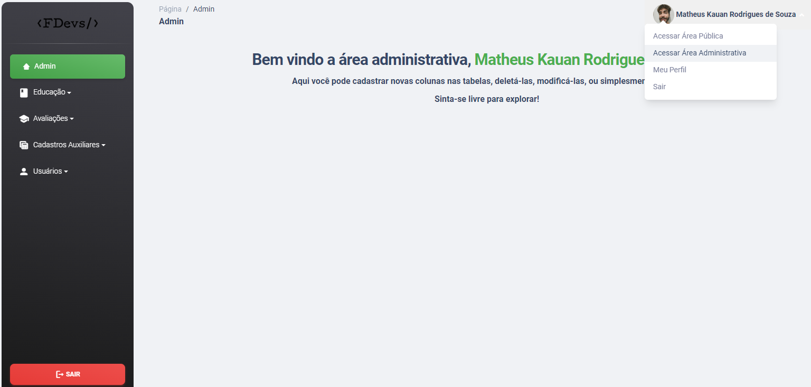

# FDEVS-MVC
Desafio projeto individual do curso FDEVS utilizando MVC, C#, Princípios SOLID e Banco de Dados

# Conta Administradora 
Usuário: admin@fdevs.com
Senha: @Admin123

# Crie o banco de dados!
Atualize o arquivo appsettings.json para acessar o seu respectivo DB no SQL Server.
No terminal, execute o comando: "Update-Database". Os dados iniciais serão preenchidos automáticamente!

# Acessar a Área Administrativa

